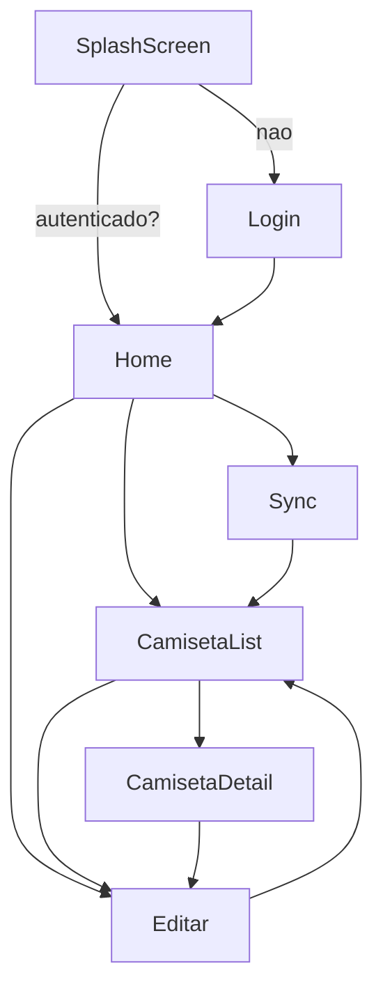
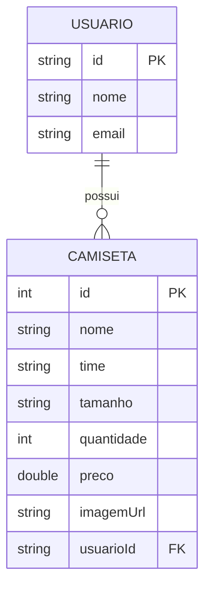

# App de Gestão de Estoque de Camisetas de Time

Equipe: Ricardo Augusto Matias da Luz – 37701568 · André Augustinho da Costa - 39483380

## Visão Geral

Aplicativo Android (Kotlin, Jetpack Compose) para lojistas/colecionadores gerenciarem estoque de camisetas. Implementa arquitetura MVVM, persistência local com Room, navegação com Navigation Compose e integração com API pública via Retrofit (JSONPlaceholder) para demonstração de sincronização de leitura.

## Tecnologias

- Kotlin, Coroutines, StateFlow
- Jetpack Compose + Material3
- Navigation Compose
- Room (persistência local)
- Retrofit (JSONPlaceholder) – usado para sincronização simples de dados de exemplo
- Coil (carregamento de imagens)

## Arquitetura (MVVM)

- data: entidades Room, DAOs, AppDatabase, repositórios
- presentation: telas Compose, NavGraph, ViewModels
- domain: (simples, casos de uso embutidos nos repositórios/ViewModels)

## Estrutura de Pastas (principal)

```
app/src/main/java/com/example/aula21/
  model/
    entity/ (Camiseta.kt, Usuario.kt, User.kt, Todo.kt)
    dao/ (CamisetaDAO.kt, UsuarioDAO.kt, ...)
    repository/ (AppDatabase.kt, CamisetaRepository.kt, UsuarioRepository.kt)
  ui/
    navigation/ (NavRoutes.kt, NavGraph.kt)
    screens/ (Splash, Login, Home, CamisetaList, CamisetaDetail, CamisetaForm, Sync)
  viewmodel/
    CamisetasViewModel.kt
```

## Requisitos Atendidos

- Navegação entre telas (Compose + NavHost) com 6 telas principais
- Persistência local com Room (2 entidades principais do tema: `Camiseta`, `Usuario`), CRUD completo e buscas por nome/time/tamanho
- Arquitetura MVVM com ViewModel e StateFlow
- UI com LazyColumn (lista), OutlinedTextField (entrada) e Button (ações)
- Integração com API usando Retrofit (JSONPlaceholder) para demonstrar pull de dados

## Diagramas

### Diagrama de Navegação (Mermaid)



### Diagrama de Banco de Dados (Mermaid)



## Endpoints (API pública via Retrofit)

- Base URL: `https://jsonplaceholder.typicode.com/`
- Endpoints utilizados:
  - `GET /users` – retorna lista de usuários
  - `GET /todos?userId={id}` – retorna tarefas do usuário
  - Observação: API somente leitura (não suporta POST/PUT/DELETE). Logo, o botão "Push" é informativo e não executa envio.

## Instruções de Execução

1. Android Studio Giraffe+ e JDK 17.
2. Sincronizar Gradle.
3. Executar no emulador/dispositivo (minSdk 24).
4. Opcional: testar sincronização de exemplo na tela "Sync" (pull baixa dados da API JSONPlaceholder e persiste localmente em Room onde aplicável).

## Credenciais de Teste (Projeto Acadêmico)

- Admin: `dezin` / `dezin123`
- Admin: `rick` / `rick123`
- Usuário (não-admin): `teste` / `teste123`

Observação: cadastro (sign up) está desabilitado; usar as contas acima.

## Como Usar (fluxo local, sem Firebase)

- Home → "Ver Estoque": lista de camisetas
- Campo de busca: filtra por nome/time/tamanho
- "Adicionar Camiseta": abre formulário para cadastrar
- Toque em um item: detalhe com opções de editar/excluir

## Decisões e Boas Práticas

- MVVM com StateFlow garantindo UI reativa
- Room com `fallbackToDestructiveMigration` para simplificar evolução de schema durante o desenvolvimento
- Navigation Compose em Activity única, fluxo simples
- Coil incluído para futura exibição de imagens por URL

## Trabalho em Equipe

- RGM 37701568 - Ricardo Augusto Matias da Luz
- RGM 39483380 - André Augustinho da Costa

### Contribuições por Integrante

- **Ricardo**
  - Integração com API via Retrofit (configuração de `RetrofitProvider`, `ApiService`).
  - Repositórios `UserRepository` e `TodoRepository` (pull de dados e persistência em Room).
  - Ajustes de sincronização na `SyncScreen` e `SyncRepository` para uso da API pública.
  - Atualização do README (endpoints, instruções, diagramas) e correção dos diagramas Mermaid.
- **André**
  - Camada de dados de estoque com Room: entidades (`Camiseta`, `Usuario`), DAOs (`CamisetaDAO`, `UsuarioDAO`) e `AppDatabase`.
  - CRUD local e buscas de `Camiseta` por nome/time/tamanho, com UI em Compose.
  - Arquitetura MVVM: `CamisetasViewModel`, rotas de navegação (`NavRoutes`, `NavGraph`) e telas (`Splash`, `Login`, `Home`, `CamisetaList`, `CamisetaDetail`, `CamisetaForm`).
  - Organização do projeto e estilo (Theme/Material3).

Observação: todos contribuíram com revisões e testes.

## Buscas Específicas (Requisito do Professor)

- Não há módulo de Clientes neste app; foi apenas um exemplo do professor e não se aplica aqui.
- **Produtos (Camisetas)**: busca por nome/time/tamanho na lista. O campo de código pode ser tratado como o `id` do item ao consultar detalhes.

## Tutorial de Uso

1. Abrir o app: inicia em `SplashScreen` e segue para `Login`.
2. Login: informar e-mail e senha quaisquer para entrar (fluxo local simplificado).
3. Home:
   - "Ver Estoque": abre a lista de camisetas.
   - "Adicionar Camiseta": cadastra nova camiseta.
   - "Sync": executa pull da API pública (somente leitura) e atualiza dados locais de exemplo.
4. Lista de Camisetas:
   - Campo de busca para filtrar por nome/time/tamanho.
   - Toque em um item para ver detalhes; é possível editar ou excluir.
5. Formulário: salvar cria/atualiza a camiseta; voltar retorna à lista.

## Próximos Passos

- Expandir integração Retrofit para endpoints relevantes ao domínio do estoque
- Associar dados remotos a entidades locais quando aplicável
- (Opcional) Upload de imagem e exibição com Coil

## Pedidos e Estoque (CRUD + Baixa)

- **Entidades**: `Pedido` e `PedidoItem` (Room) com repositório `PedidoRepository` e `PedidosViewModel`.
- **Criar Pedido (rascunho)**: botão "Novo Pedido" cria rascunho (`status = rascunho`) e abre o formulário para adicionar itens.
- **Adicionar Itens**: no formulário é possível adicionar itens pelo ID ou nome exato. A lista temporária é exibida antes de salvar.
- **Salvar Itens (somatório do total)**: ao salvar, os itens do pedido são persistidos e o `total` do pedido é recalculado como soma dos subtotais. A tela recarrega o pedido e itens para refletir o valor atualizado.
- **Editar Pedido**: na tela de detalhes, administradores podem abrir o formulário para editar itens enquanto o pedido estiver em rascunho.
- **Baixar Pedido (dar baixa no estoque)**: ação disponível apenas para administradores. Ao baixar:
  - O app valida que o pedido possui itens.
  - Para cada item, decrementa o estoque da `Camiseta` correspondente de forma transacional (falha se saldo insuficiente para qualquer item).
  - Atualiza o `status` do pedido para `baixado` e mantém o `total` como soma dos subtotais.
- **Faturar Pedido**: disponível quando `status = baixado`. Atualiza `status` para `faturado`.
- **Fechar Pedido**: disponível quando `status = faturado`. Atualiza `status` para `fechado`.
- **Mensagens de feedback**: mensagens de sucesso/erro são exibidas nas telas de formulário e detalhe do pedido.

### Fluxo Técnico

- `PedidoRepository.salvarItens(...)` apaga itens antigos, insere a lista atual e grava o `total` (soma dos subtotais) mantendo `status = rascunho`.
- `PedidoRepository.baixarPedido(...)` executa uma transação Room: verifica itens, decrementa estoque via `CamisetaDAO.decrementStock(...)` e altera `status` para `baixado` (com validação de saldo).
- `PedidosViewModel` coordena as operações e recarrega `Pedido` + itens após salvar/baixar para refletir os valores.
- UI: `PedidoFormScreen` exibe/edita itens; `PedidoDetailScreen` mostra itens, total e ações de Editar/Baixar/Faturar/Fechar (apenas admin), obedecendo o fluxo Rascunho → Baixado → Faturado → Fechado.

### Créditos

- **Ricardo**

  - Implementação das telas Login, Home e CamisetaList (listas e navegação).

  - Configuração do Navigation Compose (NavRoutes, NavGraph).

  - Integração inicial com Room (DAO e persistência básica de Camiseta).

  - Criação dos repositórios (UsuarioRepository, CamisetaRepository).

Estrutura base do README, incluindo diagramas iniciais.

- **André**

  - Desenvolvimento da camada de dados (AppDatabase, entidades Camiseta e Usuario).

  - Implementação completa dos ViewModels (CamisetasViewModel, PedidosViewModel).

  - Telas CamisetaForm, CamisetaDetail e SyncScreen com lógica de CRUD e sincronização.

  - Implementação do RetrofitProvider, ApiService, UserRepository e TodoRepository.

  - Revisão geral do código, correções e testes finais em todas as camadas.

  - Observação: As últimas alterações, correções e testes foram realizados por André, garantindoAjustes no `PedidosViewModel` para recarregar pedido/itens e garantir somatório do `total` após salvar.
  - Condicional de exibição do botão "Baixar Pedido" apenas para administradores no `PedidoFormScreen`.
